```{r setup, include=FALSE}
knitr::opts_chunk$set(echo = FALSE, fig.align='center', fig.pos = 'H', out.width="70%")
```

# Dashboard

*Note: some areas in the figures of this user guide have been erased to avoid leaking sensitive information.*

The dashboard provides an entire workflow to analyze survey comments, including uploading files, preprocessing the corpus, performing topic modeling, and interpretation of the model. 

Firstly, you can look up this *User Guide* by clicking the green button, which will redirect to the *User Guide* page.

Except for the *User Guide*, the dashboard includes 4 main interfaces:
```{r interface, fig.cap = "Dashboard Interfaces"}
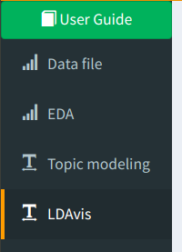
```
- **Datafile**: allows users to upload multiple survey data files, and select fields to include in the final analysis.
- **EDA**: provides some descriptive statistics about the corpus, and also allow user-specified pre-processing operations.
- **Topic modeling**: this is the main interface where users perform topic modeling using LDA, interpret the model, and download results.
- **LDAvis**: Interactive visualization for interpreting topic model.

# Data File Interface:

```{r data 1-1, fig.cap = "Data File Interface"}
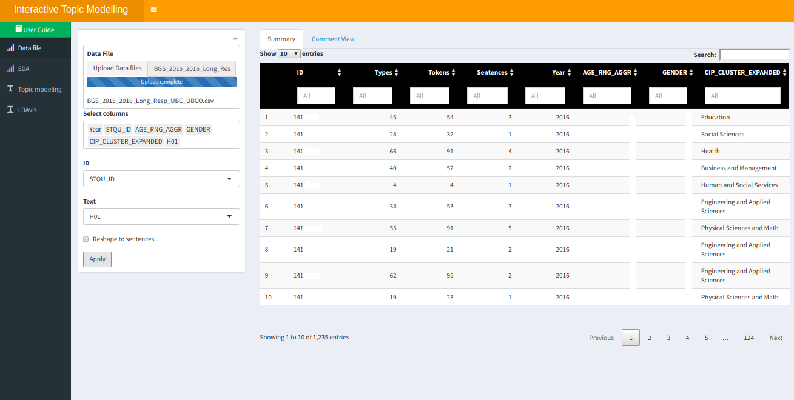
```

## Step 1: Upload data files (left panel)

1. Use **Upload Data files** button to upload the files for analysis. It only accepts CSV, and you can upload multiple files at the same time, making sure that files have the same columns.
2. **Select columns**: select the columns for included in the analysis.
3. **ID**: select the unique ID column for each comment 
4. **Text**: select the text column.
5. The checkbox **Reshape to sentences** allow to break the comment into sentences.
6. After the above selections, you can **apply** and finalize the settings.

```{r data 1-2, fig.cap = "Comment View"}
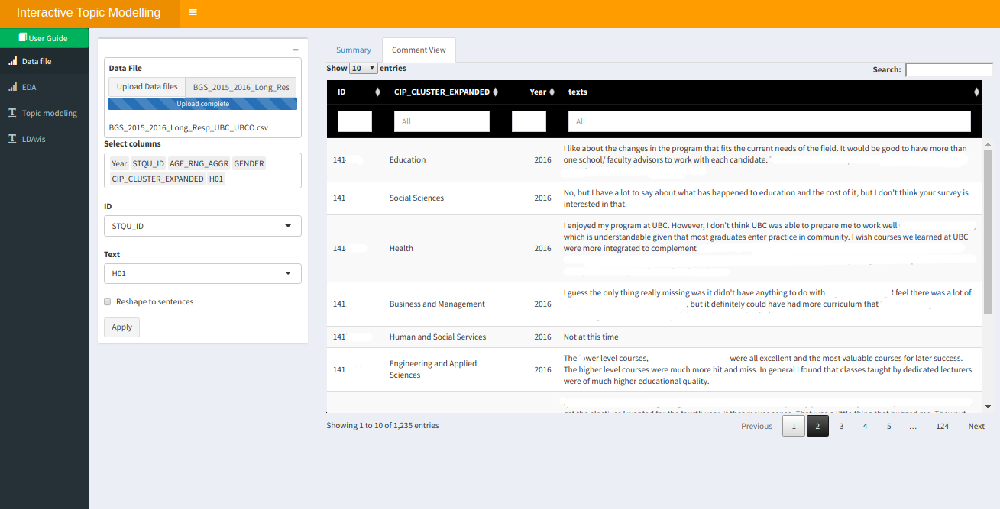
```

## Step 2: Overview of the uploaded files (right panel)

1. After **apply**, the right panel will show data table that gives a preview of the files.
2. The **Summary** tab shows all the selected columns, with *Text* column broken into 3 columns *Types, Tokens, and Sentences*.
        - *Tokens*: words, numbers, punctuations
        - *Types*: unique tokens
        - *Sentences*: number of sentences
3. To have a better idea of the actual comment, you can switch to the **Comment View** tab, where the detail comments are shown in the *texts* column.

After overviewing the files, you can go to the second interface, **EDA**.


# EDA Interface:

```{r eda 1-1, fig.cap = "EDA Interface"}
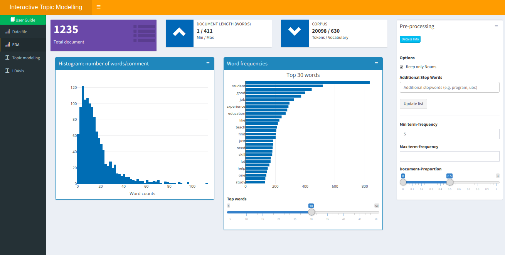
```

In this interface, you can:

- Get a brief idea of the corpus by looking at some descriptive statistics and plots. 
- Pre-process the corpus with user-specific inputs. 

## Step 3: Summary statistics and plots

At the upper part, you can know about: 

- **Total documents** of the corpus (the number may change if you *reshape to sentences* at the previous interface) 
- Maximum/minimum **Document Length** in terms of words
- Total number of **tokens** and **vocabulary** (i.e. unique number of tokens) of the corpus
        
At the bottom part, you can know about:

- The distribution of word counts for each document - **histogram**
- The sorted word frequencies of words. The slider below controls the number of top words to show.

```{r eda 1-2, fig.cap = "Summary Statistics"}
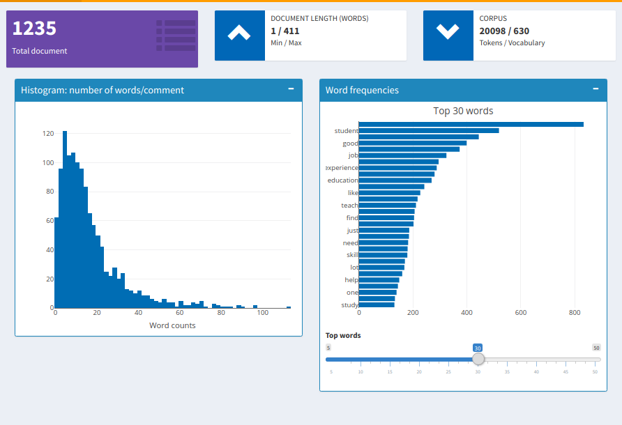
```

## Step 4: Pre-processing

By default, some standard *Natural Language Processing* techniques have been applied to the corpus. It includes **tokenization, remove numbers, remove punctuations, lemmatization, remove English stop words**. Also, words **less than 3 characters** are removed.

More options are available:

- **Keep only nouns**. That is to remove verbs, adjectives, adverbs, e.t.c.
- Provide **user-specific stop words**. This gives the flexibility to filter out words that convey little meanings based on domain knowledge. As shown in the figure below, *'program', 'student', and 'course'* are supplied as additional stop words.
- Remove words based on **maximum/minimum term frequencies** and **document proportion** (values range from 0 to 1). In this case, words with a frequency lower/higher than 5/200 will be removed. Also, words that appear at more than 0.6 of the documents will be removed.
        
```{r eda 1-3, fig.cap = "Pre-processing"}
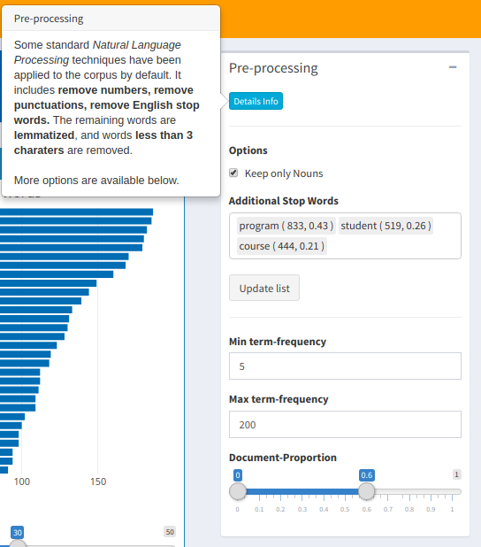
```     


# Topic Modeling and LDAvis Interfaces

```{r tm 1-1, fig.cap = "Topic Modeling Interface"}
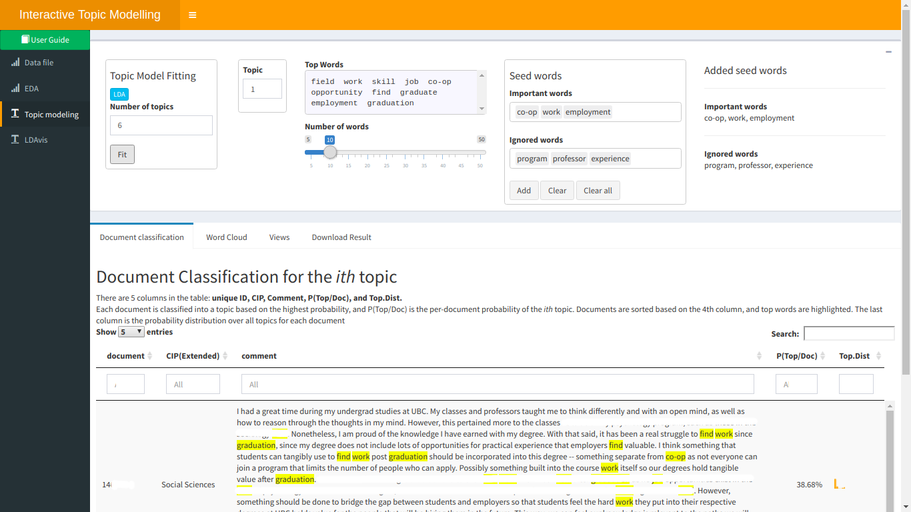
```      

```{r ldavis 1-1, fig.cap = "LDAvis Interface"}
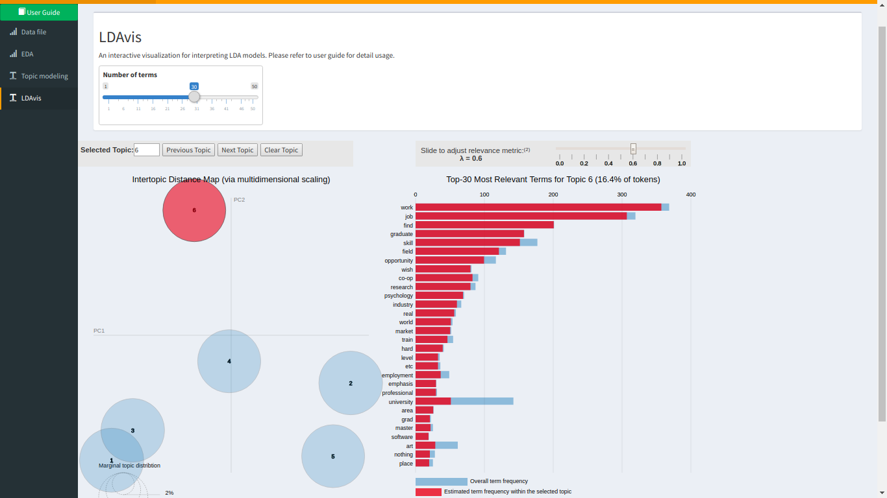
```

In these two interfaces, you can:

- Fit a topic model with LDA of a fixed number of topics (K) 
- Interpreting the model with different tools
- Download the results file

## Step 5: Train LDA model with the desired number of topics 

```{r tm 1-2, fig.cap = "Model Fitting (left part)"}
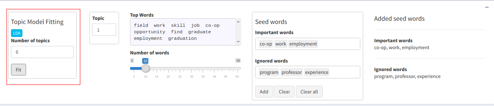
```      

1. First, choose the **number of topics** (default *K = 6*). 
2. Click **"Fit"** to fit Latent Dirichlet Allocation on the corpus.

Note:

- Try to go with default *K = 6* first, and then gradually increase *K* to refine the model. *K = 6 ~ 10* is most interpretable model for the BGS 2015 - 2016 data.
- Be cautious, running time increase with increasing number of topics. *K >= 50* can take really long time to run.

## Step 6: Model interpretation & Refitting

After fitting the model, you need to interpret the model to understand the dataset. We provide tools for model interpretation:

- Inspecting top words and the word clouds generated from these top words
- Document classification for a given topic
- LDAvis

Besides, we also provide functionalities for augmenting human efforts to analyze the data. It includes:

- Sentiment Analysis 
- Interaction with other variables: CIP, Age, and Gender

### Top words and word cloud

```{r tm 1-3, fig.cap = "Top words"}
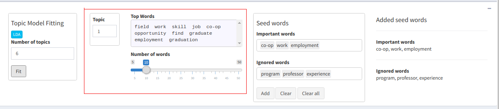
```     

```{r tm 1-4, fig.cap = "Word cloud"}
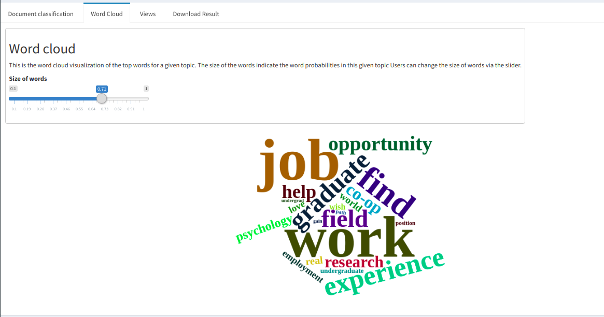
```     

Top words are the most representative words for each topic. You can first inspect the top words to interpret these topics.

At the upper panel, you can use the **Topic** widget to select the *ith* topic from the fitted model, and the associated top words will be rendered in the **Top Words** box. You can use the slider to choose the **number of top words** to show.        

At the lower panel, you can switch to the **word cloud** tab which visualizes the top words for the *ith* topic as word clouds. We encode the estimated word probabilities for a given topic as the size of each word. For example, `"job"` and `"work"` (biggest two words) are most likely generated from this topic. Besides, The **size of words** slider controls the overall size of the word clouds. 

### Document classification for a given topic

However, top words may not always be intuitive for humans to interpret them properly.

To solve this, we further provide **document classification** for a given topic. It allows users to interpret the topic by browsing through some of the most likely comments in this topic. 

There are 5 columns in the table: 

- **unique ID**: unique ID for each comment 
- **CIP**: CIP code for each ID 
- **Comment**: actual comment with key words highlighted (yellow background)
- **P(Top/Doc)**: per-document probability of the given topic
- **Top.Dist**: probability distribution over all topics

```{r tm 1-5, fig.cap = "Document classification"}
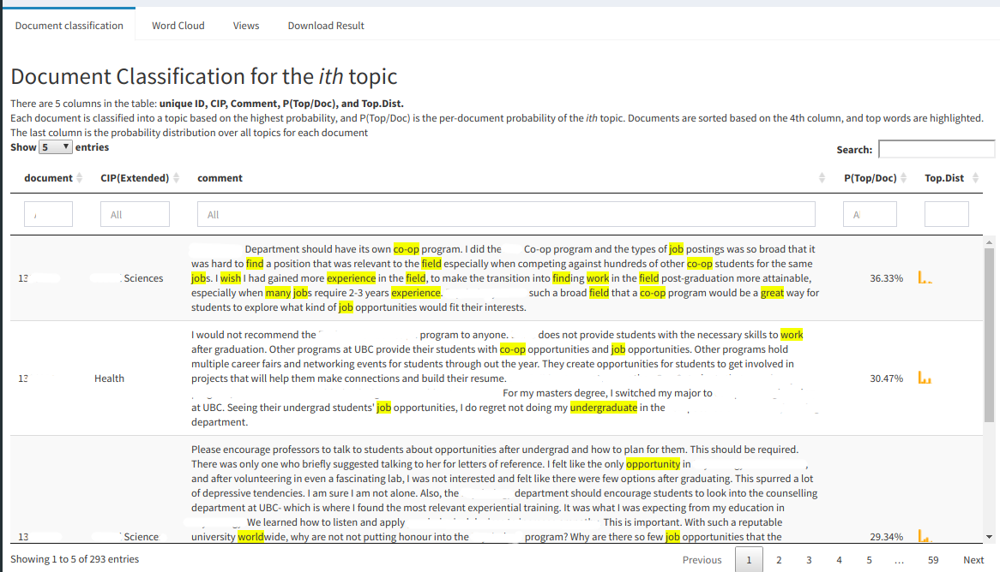
```     

Each document is classified into a topic based on the highest probability across all topics, and then sorted descendingly based on *P(Top/Doc)*. The highlighted keywords help users to read through and interpret the comments quickly. And, the last column help users understand how confident is the topic assignment.

For example, the highlighted keywords help quickly identify the student is talking about job prospect with focus on co-op. The student may also mention other topics as indicated by the last column.

### LDAvis

LDAvis is an interactive visualization tool designed to help interpret the topics in a topic model. Here we just describe the functionalities. For methodology behind LDAvis, please refer to the [original paper](https://nlp.stanford.edu/events/illvi2014/papers/sievert-illvi2014.pdf).

```{r ldavis 1-2, fig.cap = "LDAvis Interface"}

```

The left panel is a **intertopic distance map** that indicate the distance and overlap between each topic. The size of the bubbles indicates the number of tokens related to a specific topic. In our example, the sizes of the bubbles are most or less the same. Besides, the distance shows the distances and overlaps between topics. In this case, the 2 topics at the left bottom corner are overlapping. 

The right panel is the **most relevant terms** for a given topic. Relevant is a combination between estimated term frequency for a given topic, the same as *top words*, and topic-specific terms. By changing the value of $\lambda$, terms are reordered based on estimated term frequency for a given topic ($\lambda = 1$) or topic-specific terms ($\lambda = 0$). You can change different values of $\lambda$ to reorder words to interpret the model better. According to the original paper, $\lambda = 0.6$ is the best to interpret topics. 

On top of the visualization, a *slider* controls the number of words to display.

### Sentiment Analysis and Interaction with other Variables

```{r views, fig.cap = "Sentiment Analysis and Interaction with other Variables"}
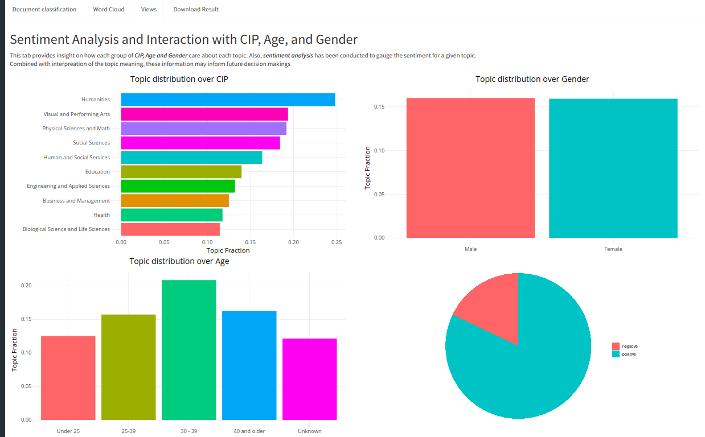
```

We also include **sentiment analysis** and **interaction with other variables** for each topic to help analyze the comments.

**Sentiment Analysis**: The process of analyzing users’ attitude related to the comment or feedback is called sentiment analysis. We use the open-source library [TextBlob](http://textblob.readthedocs.io/en/dev/) to perform the task. It will take a sentence and give a score between -1 and 1, with -1 being totally unhappy and 1 being totally happy. The result is further visualized as a pie chart for each topic. You may relate this to the current topic to analyze the text comment. For the current topic, you can know that the comments are generally positive.

**Interaction with other variables**: We have also related each topic with CIP, Age, and Gender via visualizations. You can connect these to the current topic to identify the interests or concerns of a particular group. For example, `Humanities` students concern the most about the current topic across CIP groups.

### Refitting and Seed words

```{r tm 1-6, fig.cap = "Insert seed words"}
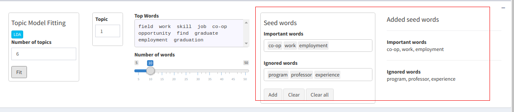
```     

The model may sometimes cluster words into a topic that users may not agree on. Therefore, you may want to refine the model for better topics discovery. You can achieve this by incorporating seed words for each topic. 

- **Important words**: words that you want to **include** in this topic
- **Ignored words**: words that you want to **exclude** in this topic

After choosing a list of important/ignored words, you can click **Add** to add the seed words for this topic. The **Added seed words** part shows the seed words being added to this topic. You can remove the seed words for a topic by clicking **Clear** and for all topics by clicking **Clear all**. For example, `co-op`, `work`, `employment` are added as important words, while `program`, `professor`, `experience` are added as ignored words for topic 1.

You can switch to each topic and add seed words and then refit the model. You can switch to each topic and add seed words, and then refit and interpret the model. This process may repeat several times until the result is satisfying.


## Step 7: Download the results

```{r download, fig.cap = "Download results"}
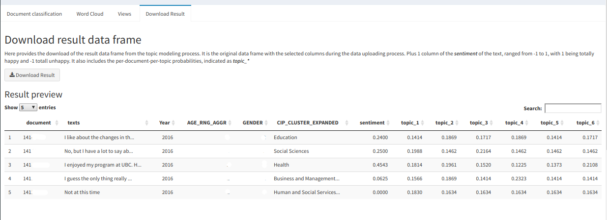
```     

When you are satisfied with the model, you can download the results as a **CSV** file.  
The downloaded file contains the original uploaded data frame in Step 1, with additional 1 column of the **sentiment** of the text, ranged from -1 (unhappy) to 1 (happy), and the per-document-per-topic probabilities indicated as **topic_* **.
    

